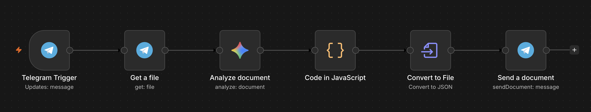

# 🧾 AI-Powered Invoice Parsing & 1C ERP Integration Pipeline

An automated, self-hosted system that ingests unstructured PDF invoices from automotive suppliers (such as Strans and Inter Cars), extracts financial metadata and line-item details using **Google Gemini API**, normalizes data schemas, and delivers ERP-ready JSON payloads via Telegram.

---

## 📌 Project Overview
Manual entry of supplier invoices into ERP systems (like 1C) is slow, repetitive, and vulnerable to typos. Invoice layouts vary wildly across suppliers, making traditional rule-based OCR tools rigid and difficult to maintain.

This project automates the entire processing chain:
1. **Ingestion:** Telegram Bot receives invoice PDFs from users/accountants.
2. **Multimodal Extraction:** Google Gemini 1.5 extracts document headers, line items, pricing, VAT amounts, brand article numbers, and 10-digit customs codes (`UKTVED`).
3. **Data Normalization & Validation:** JavaScript code nodes parse, clean, and validate line-item totals against document summary totals to ensure mathematical consistency.
4. **ERP Export:** Generates structured `.json` payloads ready for native ingestion into 1C Enterprise accounting software.

---

## 🛠 Workflow Architecture

---

## 🚀 Key Features
- **Supplier-Agnostic Extraction:** Flexibly handles complex PDF table layouts without manual template configuration.
- **Strict Data Schema:** Extracts supplier tax ID (`EDRPOU`), document date, invoice numbers, brand article codes, and 10-digit customs commodity codes (`UKTVED`).
- **Mathematical Integrity Verification:** Computes item subtotals (`price_no_vat`, `vat_amount`, `total_with_vat`) and cross-checks them against document header totals.
- **Zero-Friction UX:** Instant delivery of structured `.json` files directly back to the Telegram chat.

---

## 🛠 Tech Stack & Infrastructure
- **Orchestration:** n8n (Self-hosted on Ubuntu VPS via Docker)
- **AI Processing:** Google Gemini API (Multimodal Document Parsing)
- **Messaging API:** Telegram Bot API
- **Data Exchange Standard:** JSON / XML for 1C ERP

---

## 📈 Impact
- Reduces invoice entry time from **~5 minutes down to <10 seconds** per document.
- Eliminates human data-entry errors in 10-digit customs codes and pricing fractions.
